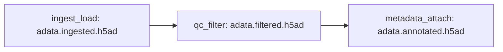

# Technical Writing

## Document Types and Templates

### Mission.md / Journal.md (sc_tools standard)
- Mission.md: todo list format with checkboxes, phases, blockers
- Journal.md: dated entries — action, rationale, decisions
- Journal.md: dated entries recording actions, rationale, and decisions
- No apostrophes in any generated documentation text

### Architecture / Design Docs
Structure:
1. Purpose (one paragraph)
2. Directory layout or component map
3. Data flow (inputs → outputs, with paths)
4. Key conventions and naming rules
5. Validation and error handling

Use Mermaid for diagrams:


### Runbooks (SLURM jobs, HPC procedures)
Structure:
1. Purpose and when to use
2. Prerequisites (cluster access, conda env, scratch path)
3. Step-by-step commands (numbered, copy-pasteable)
4. Expected outputs
5. Troubleshooting (common failures and fixes)

### API Docstrings (sc_tools functions)
```python
def filter_spots(adata: AnnData, modality: str = "visium", min_counts: int = 500) -> AnnData:
    """Filter spots/cells by QC thresholds.

    Parameters
    ----------
    adata
        AnnData object with ``total_counts`` in ``obs``.
    modality
        Platform modality. One of ``visium``, ``visium_hd``, ``xenium``, ``imc``, ``cosmx``.
    min_counts
        Minimum total counts per spot. Default varies by modality.

    Returns
    -------
    Filtered AnnData with spots below threshold removed.
    """
```

## Writing Principles

- **Active voice:** "The function loads the h5ad file" not "The h5ad file is loaded"
- **Numbered steps** for procedures, not prose paragraphs
- **Exact paths**, not vague references ("projects/visium/ggo_visium/results/", not "the results folder")
- **No apostrophes** in generated documentation (sc_tools convention)
- **Audience-aware:** for developers, assume Python literacy; for runbooks, assume HPC familiarity

## Common Mistakes to Avoid

1. Outdated paths after directory reorganization — always update references when moving files
2. Missing error cases in runbooks — document what happens when a SLURM job fails
3. Vague examples — show actual commands with real paths, not pseudocode
4. Skipping the "when to use" / "when NOT to use" section for skills
5. Documentation that drifts from code — update docs when you update the implementation
