# sc_tools — Scientific analysis tool for spatial and single-cell multiomics

**sc_tools** is a **scientific analysis tool** for **spatial and single-cell multiomics**: a Python package and pipeline for spatial transcriptomics (e.g. Visium) and single-cell RNA-seq. It provides reusable utilities (plotting, statistics, colocalization, I/O) in a scanpy-style API and is used here for **lung tumor progression and Tertiary Lymphoid Structure (TLS) transcriptomics**—identifying transcriptional and spatial differences across **Normal**, **Non-Solid (GGO)**, and **Solid** lung tumors, with a focus on TLS heterogeneity and tumor–immune niches.

The project is **buildable as an installable package** via `pyproject.toml` for use as a dependency or as a base for custom spatial/single-cell workflows.

---

## Installation

From the repository root:

```bash
# Editable install (recommended for development)
pip install -e .

# Full pipeline (deconvolution: scvi-tools, tangram)
pip install -e ".[deconvolution]"

# With optional GPU support
pip install -e ".[deconvolution,gpu]"
```

Conda users can still use `conda env create -f environment.yml` and then `pip install -e .` inside that environment. See `ENVIRONMENT_SETUP.md` for details.

---

## What this project does

- **Data:** Converts raw Visium and scRNA-seq into standardized AnnData; integrates with **scVI** for batch-corrected latent space; scores gene signatures (Seurat-based via Scanpy) from project `metadata/gene_signatures.json` (e.g. `projects/visium/ggo_visium/metadata/`).
- **Spatial analysis:** Compares tumor and immune programs across tumor types (1-vs-rest); analyzes **process colocalization** (Pearson, Moran's I, neighborhood enrichment); visualizes signature heatmaps and volcano plots; studies **macrophage–proliferation** colocalization and TLS B-cell/T-cell states.
- **Deconvolution:** Estimates cell-type proportions in spots via **Tangram** (with optional Cell2location/DestVI fallback), in batches per `library_id` for memory efficiency.
- **Outputs:** Processed AnnData objects (`results/`), manuscript-ready figures (`figures/manuscript/`), and CSV statistics. All comparisons use **FDR (Benjamini–Hochberg)** and follow the statistical and plotting rules in `skills.md`.

---

## What's important

- **Phased pipeline (non-linear):** See workflow diagram and phase summary below. See `Architecture.md` for data flow and script roles.
- **Reusable library:** The **`sc_tools`** Python package (scanpy-style API) provides generic plotting and tools so analysis scripts stay thin and reproducible:
  - **`st.pl`** — spatial plots, heatmaps/clustermaps, statistical annotations, volcano plots, versioned figure saving (PDF+PNG, dpi=300).
  - **`st.tl`** — Mann–Whitney, FDR, colocalization (Pearson, Moran's I, neighborhood enrichment), deconvolution helpers, versioned `write_h5ad`.
  - **`st.qc`** — QC metrics, filters, spatially variable genes, QC report plotting (planned).
  - **`st.data`** — caching, I/O. **`st.memory`** — profiling, GPU detection.
- **Standards:** Statistical rigor (significance bars, asterisks, adjusted p-values), no over-filtering of low-count GGO spots, and batch processing for deconvolution are mandatory. See `skills.md` and `Mission.md`.

---

## Pipeline Workflow

The pipeline is **non-linear** with human-in-loop phases. Branching points and explicit input files (e.g. clinical metadata map) bypass manual intervention.

```mermaid
flowchart LR
    subgraph P1["Phase 1: Data Ingestion & QC"]
        direction TB
        A1[Platform-specific ingestion] --> A2[Raw unnormalized AnnData]
        A2 --> A3["QC metrics"]
        A3 --> A4["QC report: figures/QC/raw/"]
        A1 --> |"Visium/HD | IMC | Xenium"| A2
    end

    subgraph P2["Phase 2: Metadata Attachment"]
        direction TB
        B1{Clinical map provided?} --> |"No: HIL"| B2[Prepare CSV/xlsx]
        B2 --> B1
        B1 --> |"Yes"| B3[Join to adata.obs]
        B3 --> B4[Clinical metadata attached]
    end

    subgraph P3["Phase 3: Preprocessing"]
        direction TB
        C1[Backup adata.raw] --> C2[Filter QC failures]
        C2 --> C3[Normalize, batch correct, cluster]
        C3 --> C5["QC report: figures/QC/post/"]
    end

    subgraph P35["Phase 3.5: Demographics"]
        direction TB
        D1[Cohort stats]
        D2[Figure 1]
    end

    subgraph P35b["Phase 3.5b: Gene Scoring, Cell Typing, Deconvolution"]
        direction TB
        D3[Hallmark + project sigs in obsm]
        D4[Automated cell typing]
        D5[Cell-type deconvolution optional]
    end

    subgraph P4["Phase 4: Manual Cell Typing"]
        direction TB
        E1[Extract cluster_id] --> E2[JSON: cluster_id→celltype]
        E2 --> E3{Satisfactory?}
        E3 --> |"No: HIL"| E2
        E3 --> |"Yes"| E4[Apply celltype + celltype_broad]
        E4 --> E5[Matrixplot, UMAP, signatures]
    end

    subgraph P5P67["Phase 5 & 6–7"]
        direction TB
        subgraph P5["Phase 5: Downstream Biology"]
            direction TB
            F1[Spatial/process analysis]
            F2[Colocalization, Moran's I]
            F3[Publication figures]
        end
        subgraph P67["Phase 6–7: Meta Analysis"]
            direction TB
            G1[Phase 6: Aggregate ROI/patient]
            G2[Phase 7: Downstream on aggregated]
        end
    end

    P1 --> P2 --> P3
    P3 --> P35
    P3 --> P35b
    P35b --> P4 --> P5P67
    P35b -.-> |"Skip Phase 4 if automated typing adequate"| P5P67
    P2 -.-> |"START HERE: preprocessed AnnData available"| P3
    P3 -.-> |"START HERE: clustered AnnData available"| P35b
    P35b -.-> |"START HERE: phenotyped AnnData available"| P4

    style P1 fill:#e3f2fd
    style P2 fill:#fff3e0
    style P3 fill:#e8f5e9
    style P35 fill:#e1f5fe
    style P35b fill:#e8eaf6
    style P4 fill:#fff3e0
    style P5 fill:#f3e5f5
    style P67 fill:#fafafa
```



| Phase | Name | Human-in-Loop? | Required Input | Output |
|-------|------|----------------|----------------|--------|
| **1** | Data Ingestion & QC | No | Platform raw data | Raw AnnData, `$(PROJECT)/figures/QC/raw/` |
| **2** | Metadata Attachment | Yes (unless map provided) | `$(PROJECT)/metadata/sample_metadata.csv` or `.xlsx` | AnnData with clinical metadata |
| **3** | Preprocessing | No | — | Filtered, normalized, clustered AnnData; `$(PROJECT)/figures/QC/post/` (no cell typing) |
| **3.5** | Demographics | Project-specific | — | Figure 1, cohort stats |
| **3.5b** | Gene scoring, automated cell typing, deconvolution | No | Hallmark + `metadata/{name}.json`; ref (deconv) | `adata.obsm['sig:...']`; phenotyped AnnData; optional deconvolution |
| **4** | Manual Cell Typing | Yes (iterative); skippable if automated adequate | JSON: `cluster_id→celltype` | Phenotyped AnnData |
| **5** | Downstream Biology | No | Phase 3.5b outputs | Spatial analysis, figures |
| **6–7** | Meta Analysis | No | — | ROI/patient aggregated results |

---

## What's still being worked on

- **Deconvolution:** Pinpointing minimum data size and memory limits for Cell2location/DestVI; refining gene signatures and validating against HLCA/MSigDB/TCGA LUAD.
- **Spatial:** Spatially variable genes (SVG), cell-type colocalization from deconvolution, spatial transition areas (Normal ↔ Non-Solid ↔ Solid, tumor–TLS), and macrophage state comparison across tumor types.
- **TLS:** TLS niche extraction and lymphoid-rich neighborhood analysis.

---

## Repository layout

| Path | Purpose |
|------|--------|
| `sc_tools/` | Reusable Python package (pl, tl, qc, data, memory, utils) |
| `scripts/` | Analysis scripts (preprocessing, deconvolution, spatial, figures); includes `old_code/` |
| `projects/<platform>/<project>/metadata/` | Gene signatures (JSON), sample metadata (project-specific) |
| `projects/` | Projects by data type (visium, visium_hd, xenium, imc, cosmx); each can have Mission.md, Journal.md |
| `projects/create_project.sh` | Create a new project: `./projects/create_project.sh <project_name> <data_type>` |
| `projects/visium/ggo_visium/` | GGO Visium project (Mission.md, Journal.md for study-specific goals and log) |

Processed outputs (e.g. `results/`, `figures/`) live at root or under a project when using the project layout. Key docs: **`Mission.md`** (toolkit objectives, testing strategy), **`Architecture.md`** (phases, data flow, testing structure, key files), **`Journal.md`** (repo-level decisions), **`skills.md`** (statistical and coding standards). Per-project Mission and Journal live under `projects/<data_type>/<project_name>/`.

---

## Setup (environments)

- **Conda:** `conda env create -f environment.yml`, then `conda activate ggo_visium` and `pip install -e .` to install the package.
- **pip only:** `python -m venv venv`, activate, then `pip install -e ".[deconvolution]"` (or `pip install -r requirements.txt` for a non-package install).

See `ENVIRONMENT_SETUP.md` for details. Core stack: **scanpy**, **squidpy**, **anndata**; optional **scvi-tools**, **tangram**, **cell2location** for deconvolution.

---

## Running the pipeline

The **Makefile** defines targets in execution order (ingestion → preprocessing → scoring → deconvolution → spatial/figures). Run `make` or `make help` and use the annotated targets for reproducibility.

---

## License and contact

Internal research project. For questions or collaboration, contact the repository maintainers or the Yoffe Lab.
