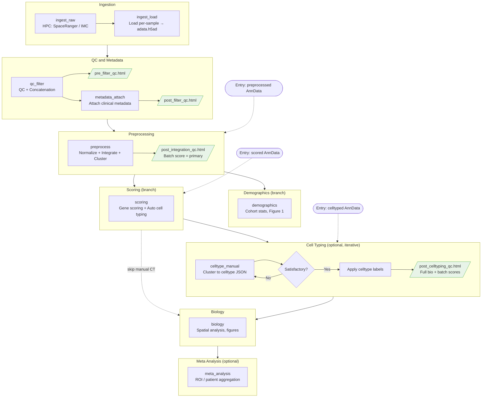

# sc_tools — Spatial and Single-Cell Omics Toolkit

[](https://github.com/yoffelab/sc_tools/actions/workflows/ci.yml)
[](https://pypi.org/project/sci-sc-tools/)
[](https://pypi.org/project/sci-sc-tools/)
[](LICENSE)
[](https://sc-tools.readthedocs.io)

**sc_tools** is a reusable Python toolkit and pipeline for spatial transcriptomics and single-cell omics. It wraps scanpy, squidpy, scVI-tools, and related libraries in a consistent API and provides a phased, Snakemake-driven workflow for multi-modality projects (Visium, Visium HD, Xenium, IMC, CosMx).

The package is installable via `pyproject.toml` and designed to be shared across projects. Project-specific data, results, and figures all live under `projects/<platform>/<project_name>/`.

---

## Installation

From the repository root:

```bash
# Minimal install (plotting, QC, gene scoring)
pip install -e .

# Full pipeline (deconvolution: scvi-tools, tangram)
pip install -e ".[deconvolution]"

# Common combinations
pip install -e ".[deconvolution,integration,geneset]"
pip install -e ".[deconvolution,gpu]"
```

**Available extras:**

| Extra | Installs | When to use |
|-------|----------|-------------|
| `deconvolution` | scvi-tools, tangram-sc | Cell-type deconvolution (Cell2location, Tangram, DestVI) |
| `integration` | harmonypy | Harmony batch correction |
| `geneset` | gseapy, pyucell | GSEA pseudobulk, UCell scoring |
| `decoupler` | decoupler | TF/pathway activity |
| `spatial` | utag | Spatial-aware clustering (UTAG) |
| `gpu` | torch, rapids-singlecell | GPU-accelerated preprocessing |
| `viz` | marsilea | Declarative composite figures |
| `benchmark` | scikit-image, scib-metrics, cellpose, stardist | Segmentation/integration benchmarking |
| `dev` | pytest, ruff | Development and testing |
| `docs` | sphinx, pydata-sphinx-theme, myst-nb | Build documentation |

**Lint (required before commit):** `make lint` runs Ruff check and format on `sc_tools`.

**Container:** See [project_setup.md](project_setup.md) for Apptainer/Docker setup and per-project usage.

---

## What sc_tools provides

| Module | Purpose |
|--------|---------|
| `sc_tools.pl` | Spatial plots, heatmaps, statistical annotations, volcano plots, GSEA dotplots, versioned PDF+PNG saving |
| `sc_tools.tl` | Signature scoring (scanpy/UCell/ssGSEA), gene set loaders (Hallmark bundled), ORA/GSEA, colocalization, deconvolution |
| `sc_tools.qc` | Per-sample QC filtering, cross-sample comparison plots, HTML QC reports |
| `sc_tools.pp` | Modality-aware preprocessing recipes: normalize, integrate (scVI/Harmony/CytoVI), reduce, cluster |
| `sc_tools.ingest` | Batch manifests (`metadata/phase0/`), Space Ranger/Xenium/IMC command builders, AnnData loaders per modality, `concat_samples()` |
| `sc_tools.validate` | Checkpoint validation for p1–p4 (required obs keys, obsm, representation); auto-fix; CLI for Snakemake |
| `sc_tools.memory` | Memory profiling, GPU detection and auto-backend selection |

---

## Pipeline Workflow

The pipeline is **non-linear** with human-in-loop phases. Branching points and explicit input files (e.g. clinical metadata) bypass manual steps.



| Slug | Old code | Name | Human-in-Loop? | Checkpoint | QC Report |
|------|----------|------|----------------|------------|-----------|
| `ingest_raw` | p0a | Platform tools (Space Ranger / Xenium / IMC) | No | `data/{sample_id}/outs/` | |
| `ingest_load` | p0b | Load per-sample into AnnData | No | `data/{sample_id}/adata.h5ad` | |
| `qc_filter` | p1 | QC and Concatenation | No | `results/adata.raw.h5ad` | `pre_filter_qc_YYYYMMDD.html` |
| `metadata_attach` | p2 | Metadata Attachment | Yes (unless map provided) | `results/adata.annotated.h5ad` | `post_filter_qc_YYYYMMDD.html` |
| `preprocess` | p3 | Preprocessing | No | `results/adata.normalized.h5ad` | `post_integration_qc_YYYYMMDD.html` |
| `demographics` | p3.5 | Demographics (branch, optional) | Project-specific | Figure 1 | |
| `scoring` | p3.5b | Gene Scoring / Auto Cell Typing / Deconvolution | No | `results/adata.scored.h5ad` | |
| `celltype_manual` | p4 | Manual Cell Typing (optional, iterative) | Yes | `results/adata.celltyped.h5ad` | `post_celltyping_qc_YYYYMMDD.html` |
| `biology` | p5 | Downstream Biology | No | `figures/manuscript/` | |
| `meta_analysis` | p6/p7 | Meta Analysis (optional) | No | `results/adata.{level}.{feature}.h5ad` | |

---

## Repository layout

```text
sc_tools/               # Reusable Python package (pl, tl, qc, pp, ingest, validate, memory, utils)
scripts/                # Shared scripts and run_container.sh
projects/               # All project-specific content
    create_project.sh   # ./projects/create_project.sh <project_name> <data_type>
    <platform>/
        <project_name>/
            data/           # Raw sequencing and imaging
            metadata/       # Gene signatures, sample_metadata.csv, celltype_map.json
            results/        # AnnData checkpoints (.h5ad)
            figures/        # QC, manuscript figures
            scripts/        # Project-specific analysis scripts
            outputs/        # Intermediate outputs (deconvolution logs, etc.)
            tests/          # Project integration tests
            Snakefile       # Project pipeline
            Mission.md      # Project todo list
            Journal.md      # Project decision log
docs/                   # Sphinx API documentation (make docs)
containers/             # Apptainer SIF and Dockerfile
```

Key docs: **`Mission.md`** (toolkit todos), **`Architecture.md`** (data flow, checkpoint contracts), **`skills.md`** (statistical and coding standards), **`project_setup.md`** (container and environment setup).

---

## Running the pipeline

Each project uses **Snakemake** as the workflow engine. From the repo root:

```bash
# Run a project target
snakemake -d projects/visium_hd/robin -s projects/visium_hd/robin/Snakefile all

# Run with container (auto-detects Apptainer on Linux, Docker on macOS)
./scripts/run_container.sh projects/visium_hd/robin python scripts/run_signature_scoring.py

# Override runtime
SC_TOOLS_RUNTIME=docker ./scripts/run_container.sh projects/visium/ggo_visium
```

See [project_setup.md](project_setup.md) for container build instructions and per-project setup.

---

## License and contact

Internal research project. For questions or collaboration, contact the repository maintainers or the Yoffe Lab.
