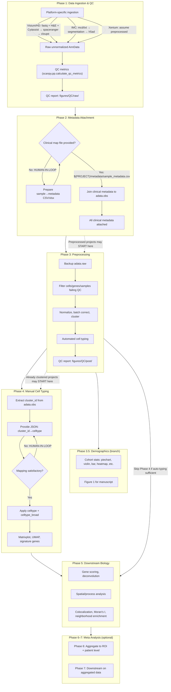

# sc_tools Pipeline Workflow

This document describes the **non-linear** analysis pipeline with human-in-the-loop phases. The workflow includes branching points and requires explicit input files (e.g., clinical metadata map) to bypass manual intervention.

**Rendering:** The Mermaid diagram below renders in GitHub, GitLab, and many Markdown viewers. To export as PNG/SVG, use [Mermaid CLI](https://github.com/mermaid-js/mermaid-cli): `mmdc -i WORKFLOW.md -o workflow_diagram.png`.

---

## Workflow Diagram

---

## Phase Summary

| Phase | Name | Human-in-Loop? | Required Input | Output |
|-------|------|----------------|----------------|--------|
| **1** | Data Ingestion & QC | No | Platform raw data | Raw AnnData, `$(PROJECT)/figures/QC/raw/` |
| **2** | Metadata Attachment | Yes (unless map provided) | `$(PROJECT)/metadata/sample_metadata.csv` or `.xlsx` | AnnData with clinical metadata |
| **3** | Preprocessing | No | — | Filtered, normalized, clustered AnnData; `$(PROJECT)/figures/QC/post/` |
| **3.5** | Demographics | Project-specific | — | Figure 1, cohort stats |
| **4** | Manual Cell Typing | Yes (iterative) | JSON: `cluster_id→celltype` | Phenotyped AnnData |
| **5** | Downstream Biology | No | — | Gene scores, spatial analysis, figures |
| **6–7** | Meta Analysis | No | — | ROI/patient aggregated results |

---

## Key File Descriptions

All paths are project-specific under `projects/<platform>/<project_name>/`.

| File / Path | Description |
|-------------|-------------|
| `metadata/sample_metadata.csv` or `.xlsx` | Sample→clinical metadata map. Enables Phase 2 without human-in-loop. Columns: `sample` (matches `adata.obs['sample']`), plus any clinical columns. |
| `metadata/celltype_map.json` | Cluster→celltype mapping for Phase 4. Format: `{cluster_id: {celltype_name: "...", total_obs_count: N}}`. cluster_id type must match `adata.obs` (string/int). |
| `adata.obs['sample']` | Annotates original sample origin. Required after Phase 1. |
| `adata.obs['raw_data_dir']` | Backup path for original data location. Required after Phase 1. |
| `adata.obsm['spatial']` | Spatial coordinates for spatial platforms. |
| `figures/QC/raw/` | Pre-normalization QC reports (2x2 histogram grid, spatial multipage). |
| `figures/QC/post/` | Post-normalization QC reports. |
